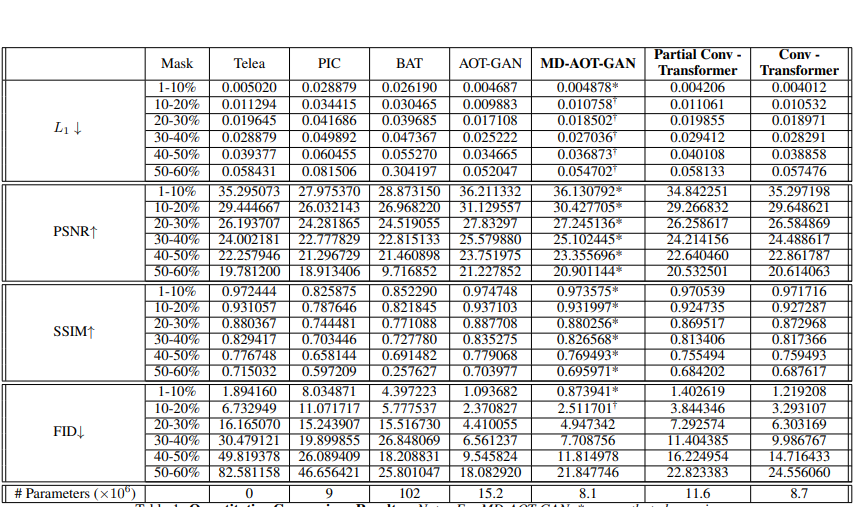

This is the repository for the transformer models of the project Image Inpainting using Small Conditional Generative Models, done as part of the course CSC 2541: Generative AI for IMages at University of Toronto.

This repository contains code for both the Partial Conv- Transformer model and the Conv-Transformer Model. 

Description of the Models.

1. model.py - contains the definition of the Conv-Transformer Model
2. model_partial.py - contains the definition of the Partial Conv - Transformer Model
3. model_ablation_LUNA_partial.py - contains the model used for ablation, contains only the LUNA layers.
4. model_ablation_RDB_partial.py - contains the code for the ablative model which uses only RDB layers.

5. Nested_Deformed_transformer_partial.py -> the LUNA layer used in the Partial COnv-Transformer
6. Nested_Deformed_transformer.py - > the LUNA layer used in Conv- Transformer.

In order to run the training on the models.
In the train.py file, set your wandb api key and call the relevant model file in the import section. Also update the model config and include the ckpt_path, train_path, train_mask_path and val images and mask paths in the model_config.yml
Then run:  python train.py

In order to run inference, load the model weights into the appropriate model (by calling in the import statement) and set the test_ckpt in the config file. Also set the path where the photos will be saved. Also set the test data and masks in the config file

to run test: python test.py

The requirements for the programs can be found in requirements.txt

The pretrained models have been uploaded here: 
1. Partial Conv- transformer: https://www.dropbox.com/scl/fi/zyt206k224ov7htrf5zn0/model_50.pth?rlkey=baeznmc2f90pnz9qj43vlp4o2&st=8f6f89an&dl=0
2. Conv-Transformer : https://www.dropbox.com/scl/fi/wu2vaxtvmqeunwc999df6/model_55.pth?rlkey=0ex8h732ngdnpk9jrnsibjko5&st=gc5a3iuo&dl=0

Repository inspired by https://github.com/bobo0303/LIGHTWEIGHT-IMAGE-INPAINTING-BY-STRIPE-WINDOW-TRANSFORMER-WITH-JOINT-ATTENTION-TO-CNN